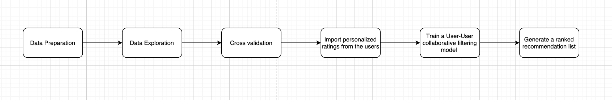
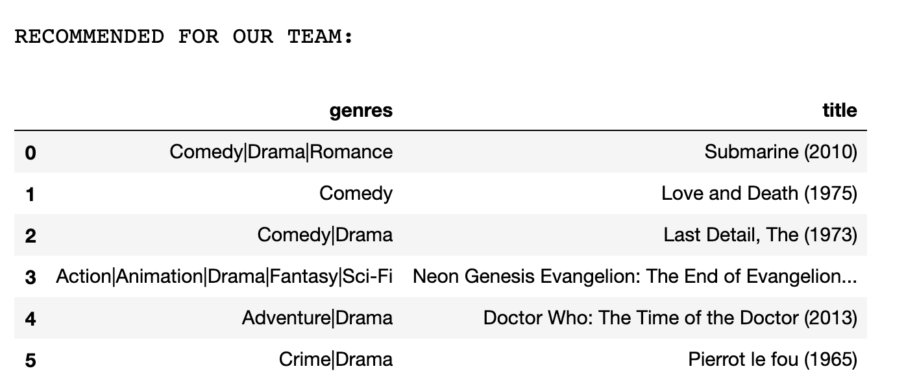
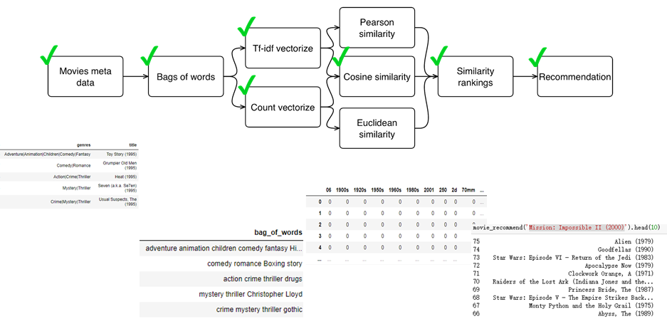
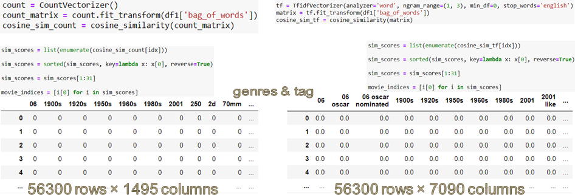
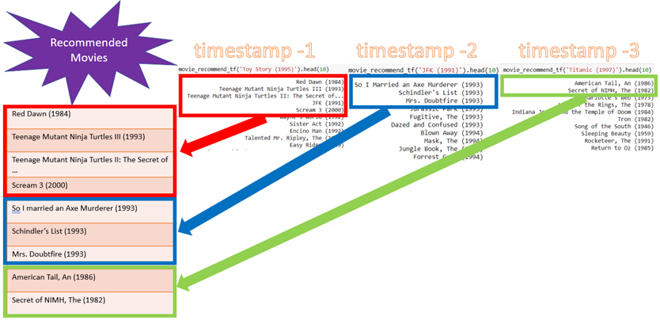
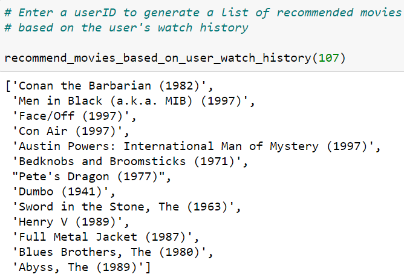
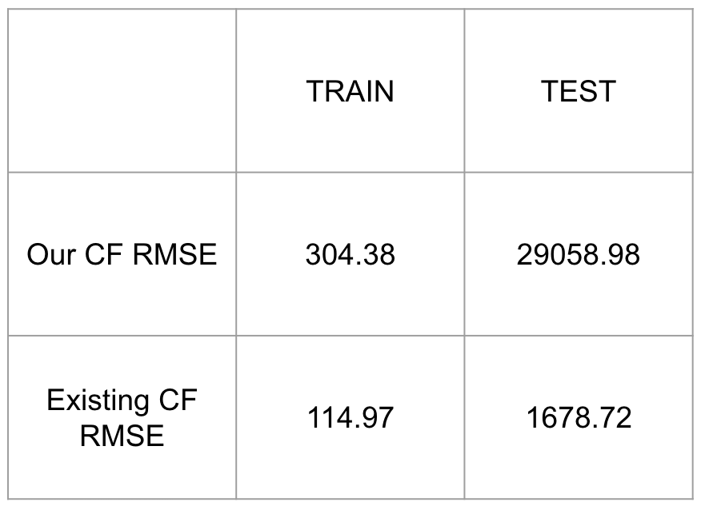
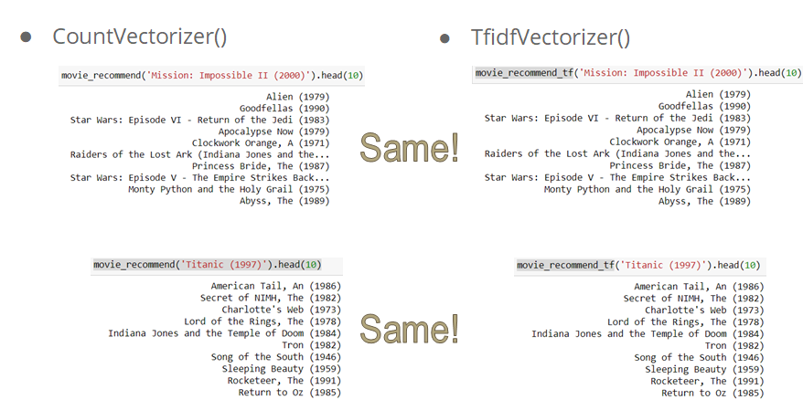
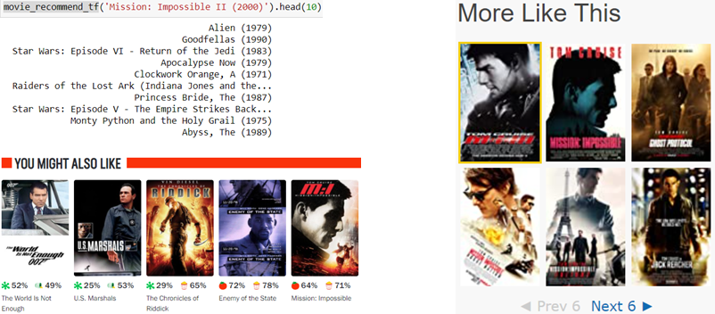
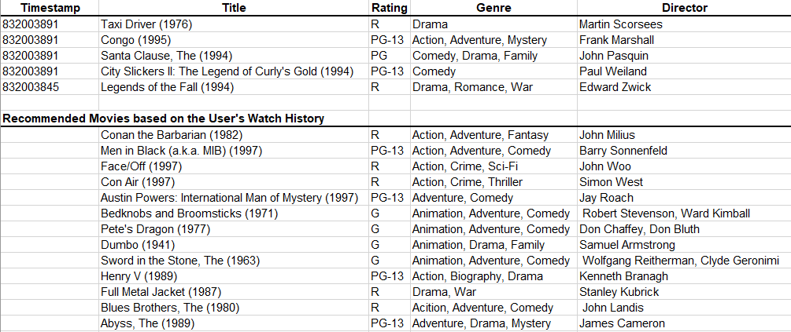

# Movies Recommendation System 
## Problem Statement
As we set out to design and implement a robust movie recommendation system, we identified the following challenges that needed to be addressed in our implementation:
1. How will you design your recommendation system if you want to recommend movies watched by "similar" users? How to determine if users are "similar"? How to evaluate if the recommendation is effective?
2. How will you improve your model if user behavior is considered stateful? In other words, if you are also given the watching history of a user ordered by time, how are you going to recommend the next movie for that user? How to evaluate if the recommendation is effective in this case?
3. How to recommend movies to new users in the absence of a user history?
As stated above, we described a problem that we plan to solve along with three challenges that need to be addressed in our implementation of a movie recommendation system.  

## Dataset(s)
MovieLens DataSet is one of the most common datasets that were collected over various periods of time, depending on the version and size for building a Movie Recommendation Systems. Our team uses an education-small version that contains 100,000 ratings and 36 tags applications with size of 1M. 
The dataset was initially generated by GroupLens researchers in 2000 and changed over the time. The latest update was on 09/2018. The original zip file contains four CSV files that describe the attributes including links, movies, ratings and tags and a README file.

## Approaches/Techniques/Algorithms
The approaches, techniques, and algorithms that we ended up using for designing and implementing our movie recommendation system.

#### Collaborative Filtering based Recommendation
In this project, our team is focusing on the User-User based model based the overall evaluation on the targets users, computing time and the level of difficulty to implement the algorithm.

The picture above shows the general workflow for our collaborative filtering method including data preparation, data exploration, cross validation, importing personalized ratings, training model and combining final result.
The following pictures will clearly demonstrate the separated result from final hybrid result for the entire team.

#### Content-based Recommendation
We used the content-based approach in recommending movies based on the similarity of move attributes as the input for building a content-based recommender is movie attributes (metadata). For example, if a user watches a comedy starring Adam Sandle, the system will recommend movies in the same genre, starring the same actor or both.

As seen above, given the input movie attributes (metadata), we combine the ‘genres’ and ‘tag’ columns into the ‘bag_of_words’ column, which we use for vectorizing: CountVectorize() and TfidfVectorizer().  Then, we compute the consine_similarity matrix and similarity rankings before finally recommending movies.  

In the following figure, we’d like to note that CountVectorizer(Ref. 1) converts the ‘bag_of_words’ into a matrix of token counts in ints, whereas TfidfVectorizer(Ref. 2) converts the ‘bag_of_words’ into a matrix of TF-IDF features in floats.  By comparison, the TF-IDF features matrix is larger than the token count matrix in terms of columns: 7090 columns vs. 1495 columns as seen below.

#### Recommending Movies Based on the User’s Watch History
To address the problem stated in the title, we came up with our own movie recommender that accounts for the user's watch history as shown below. 

For the most recent N timestamps, we use the content-based recommender in recommending movies for the particular movie that the user watched at that timestamp.  

For the user with userID of 107, our movie recommender suggests a list of movies based on the user’s watch history as seen on the right. 

## Experimental results and analysis
In this section, we’re going to describe experimental results and analysis that we conducted on the following approaches, techniques, and algorithms: Collaborative filtering, content-based, and recommending movies based on the user’s watch history.
### Collaborative Filtering
By implementing the User-based collaborative filtering, the algorithm will generate a recommended list separately for each team member. After combining all of the lists, we will have a final result for the movie night.  To effectively evaluate our model, we believe that the best way is by comparing our model with other existing algorithms. Root mean squared error(RMSE) is one of the most popular metrics used to evaluate the accuracy of a model. The equation is listed below.

computing results showing in the table.

### Content-based Recommendation
Because TfidfVectorizer() has more columns, it requires more computing resources.  Hence, for our implementation of the content-based recommendation system, CountVectorizer() is a better choice.  After sorting the similarity rankings, both CountVectorizer() and TfidfVectorizer() recommend the same list of 10 movies for an input movie ‘Mission Impossible II (2000)’ as shown below.

Because it’s difficult for us to evaluate our content-based recommender whether it recommends a good list of movies based on an input movie, we decided to compare our results to both Rotten Tomatoes and IMDb’s suggested movies to conduct a qualitative analysis.  Both Rotten Tomatoes and IMDb’s recommendation systems suggest two different lists of movies as seen below.  This tells us that at a minimum, they use different movie attributes from our movie attributes that are found in our “bag_of_words” column.

In addition to differing movie attributes, both Rotten Tomatoes and IMDb are likely to use additional functions that render different lists of suggested movies.  For instance, IMDb seems to put more weight on the actors and movie titles, whereas Rotten Tomatoes seems to put more emphasis on the genres of the input movie “Mission: Impossible II (2000).”

### Recommending Movies based on the User’s Watch History
We analyzed the attributes of the movies that userID ‘107’ watched at the most 5 recent timestamps and compared them to the recommended movies with respect to rating and genres.  As seen below, our ‘recommend_movies_based_on_user_watch_history’ function works well because the rating and genres of which movies recommended by our function match those of the moves that the userID ‘107’ watched at the most recent timestamps.  

## Future work 
There is some additional work that could be done in the future.
To have better interaction between users and our recommendation model, we could develop a mobile app that users have easy-access to our built model. In addition, since we only adopted RMSE as an evaluation metric for collaborative filtering methods, other well-known metrics for recommendation problems could be used, such as MAP@K, MAR@K, Personalization, or Intra-list Similarity. Because the idea of watch history only implemented using metadata like movie's title, genre etc, thus another pending work could implement the same logic using users' ratings on watched movies. The implementation of low-dimensional factor models could also be considered.

## References
1. https://towardsdatascience.com/how-to-build-from-scratch-a-content-based-movie-recommender-with-natural-language-processing-25ad400eb243
2. https://analyticsindiamag.com/how-to-build-a-content-based-movie-recommendation-system-in-python/
3. Agrawal S & Jain P (2017). An Improved Approach for Movie Recommendation System. Retrieved from: IEEE Xplore
4. Chen L & Zhou T. (2017) Movie Recommendation System Employing the User-based CF in Cloud Computing. Retrieved from: IEEE Xplore.
